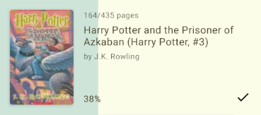

# SwipeProgressView

 [](https://android-arsenal.com/api?level=21)

**TODO:** CI, Android Arsenal

___

An interactive view representing generic progress that can be altered by user with swipe gestures.



_The above sample is from my [ReadTracker] application. In this layout, [SwipeProgressView] is a container view which handles swipe gestures, draws progress background and provides listeners for other views to update correspondingly._

# Quick start

1. Define [SwipeProgressView] in layout

```xml
<me.thanel.swipeprogressview.SwipeProgressView
    android:id="@+id/swipeProgressView"
    android:layout_width="match_parent"
    android:layout_height="match_parent"
    android:mirrorForRtl="false"
    android:progress="0"
    android:progressDrawable="?colorControlActivated"
    app:spv_maxProgress="100"
    app:spv_minProgress="0" />
```

2. Access and modify [SwipeProgressView] from code

```kt
val swipeProgressView = findViewById<SwipeProgressView>(R.id.swipeProgressView)
swipeProgressView.maxProgress = 200
swipeProgressView.minProgress = -120
swipeProgressView.progress = 15
swipeProgressView.setOnProgressChangeListener { progress ->
   // Handle progress updates
}
```

For detailed information about what is possible see [API Documentation].

# License

```
Copyright 2019 Łukasz Rutkowski

Licensed under the Apache License, Version 2.0 (the "License");
you may not use this file except in compliance with the License.
You may obtain a copy of the License at

   http://www.apache.org/licenses/LICENSE-2.0

Unless required by applicable law or agreed to in writing, software
distributed under the License is distributed on an "AS IS" BASIS,
WITHOUT WARRANTIES OR CONDITIONS OF ANY KIND, either express or implied.
See the License for the specific language governing permissions and
limitations under the License.
```

[API Documentation]: https://tunous.github.io/SwipeProgressView/swipeprogressview
[ReadTracker]: https://github.com/Tunous/ReadTracker
[SwipeProgressView]: https://tunous.github.io/SwipeProgressView/swipeprogressview/me.thanel.swipeprogressview/-swipe-progress-view/index.html